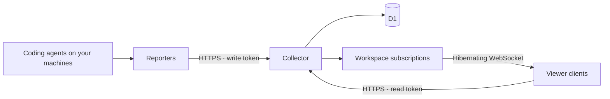

# AI Agent Collector

Collect coding-agent activity across machines and make it available to any client.
Track running sessions, agents waiting for attention, and token usage in one place.

The collector runs on **Cloudflare Workers + D1**, with **hibernating WebSockets**
for change notifications. Agent hooks report through a single Rust daemon on each machine.
**AwesomeWM is the first viewer client**; the same API can support Windows tray
apps, macOS menu-bar apps, and other interfaces.

The collector owns authentication, event ordering, session state, usage accounting,
and retention. Reporters observe agents on a machine and submit metadata. Viewer
clients display the shared state and need no access to agent processes or transcripts.

## Get started

1. [Run the collector and provision credentials](collector/README.md).
2. [Install the Rust daemon](reporters/rust/README.md) on each agent machine.
3. [Connect the AwesomeWM client](clients/awesomewm/README.md), or
   [build another client](docs/client-protocol.md).

Each reporter gets an installation-bound write token. Viewers use separate read
tokens. The reporter spools events during outages, retries with stable IDs, and
sends process observations separately from lifecycle history. Prompts, generated
text, commands, and tool payloads stay on the source machine.

Clients subscribe to revision notifications and fetch snapshots when state changes.
They recover missed notifications by fetching a fresh snapshot after reconnecting.
Quiet sessions remain distinguishable from stale or unverified sessions; missing
usage is shown explicitly rather than counted as zero.

## Repository layout

| Directory | Responsibility |
| --- | --- |
| [`collector/`](collector/) | Worker, D1 migrations, authentication, accounting, WebSocket subscriptions, provisioning, server tests |
| [`reporters/`](reporters/README.md) | Agent integrations that submit observations; the Linux Rust daemon and legacy shell reporter |
| [`clients/`](clients/README.md) | Interfaces that consume the collector; currently AwesomeWM |
| [`docs/`](docs/) | Architecture, public client protocol, and migration guide |
| [`scripts/`](scripts/) | Repository-wide local checks |

The collector can be developed and run without installing AwesomeWM, Lua, or the
reporter. Client-specific dependencies and tests live with their client.
The existing repository URL remains unchanged.

## Platform support

| Component | Available now | Future extensions |
| --- | --- | --- |
| Collector | Cloudflare Workers; local development through Wrangler | More consumers of the existing API |
| Agent reporter | Linux Rust daemon; Claude Code and Codex hooks | Native Windows/macOS reporters and other agent adapters |
| Viewer | AwesomeWM on Linux | Windows tray and macOS menu-bar clients |

Windows and macOS clients are not implemented yet. A future viewer on either OS
can monitor agents reported from Linux machines; observing agents running natively
on those operating systems also requires a compatible reporter. The protocol keeps
those two roles independent.

## Development and migration

Install the collector dependencies with `cd collector && pnpm install --frozen-lockfile`.
See [CONTRIBUTING.md](CONTRIBUTING.md) for component boundaries and checks, and
[docs/architecture.md](docs/architecture.md) for the collector design.

Existing `require("lib.ai")`, root `hook.sh`, and root `install-hooks.sh` entry
points remain as compatibility forwarders. New installations should use the
component paths above. See the [migration guide](docs/migration.md) for existing
widget configurations and migration from reconciliation timers.

## License

MIT. The AwesomeWM client vendors `dkjson.lua` under its original MIT license.
