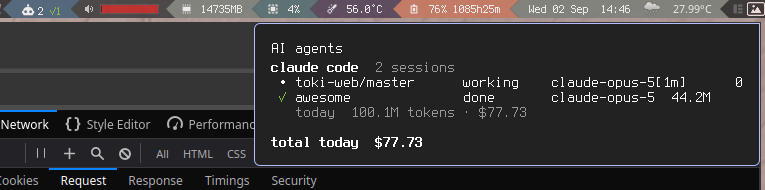

# AwesomeWM client

A wibar viewer for the AI Agent Collector. Hover for per-agent and per-machine
sessions and usage; right-click to refresh. Requires AwesomeWM, Lua with `lgi`,
and the libsoup 3 introspection package (`Soup-3.0`) for cloud access.



## Connect to a collector

Install the repository under your AwesomeWM configuration, for example as `lib/ai`:

```sh
cd ~/.config/awesome
git submodule add https://github.com/wooparadog/awesome-ai-agents.git lib/ai
```

[Set up the collector](../../collector/README.md) and provision a **read token**
for this viewer. Reporting agents are configured separately through the
[shell reporter](../../reporters/shell/README.md); a viewing desktop need not run it.

```lua
local ai_agents = require("lib.ai.clients.awesomewm")
local ai = ai_agents({
  cloud = {
    url = "https://your-collector.example",
    token_file = "/home/you/.config/ai-agents/read.token",
  },
  settings = function(state, widget)
    local text = "AI " .. state.total
    if state.asking > 0 then text = text .. " ?" .. state.asking end
    if state.done > 0 then text = text .. " ✓" .. state.done end
    if (state.stale or 0) > 0 then text = text .. " stale:" .. state.stale end
    if (state.unverified or 0) > 0 then text = text .. " unverified:" .. state.unverified end
    if state.connection ~= "connected" then text = text .. " offline" end
    widget:set_text(text)
  end,
})
-- Add ai.widget to your wibar.
```

Cloud mode receives hibernating WebSocket invalidations, acknowledges snapshot
revisions, and recovers by refreshing after reconnecting. There is no routine
snapshot polling. The last snapshot remains visible during an outage, with the
connection marked accordingly. Presence expiry is also applied locally so stale
sessions are not counted as confirmed live while the collector is unreachable.

`total`, `busy`, `asking`, and `done` count runs with recent process observations.
Stale and unverified runs remain in the popup with machine/project labels. Missing
usage appears as unavailable. The server supplies accounting and reporting-day
boundaries. The handle exposes `widget`, `state`, `update()`, `show_popup()`,
`hide_popup()`, and `stop()`; call `stop()` when removing a cloud widget.

| Option | Purpose |
| --- | --- |
| `cloud.url`, `cloud.token_file` | Collector URL and private read credential |
| `settings(state, widget)` | Render the wibar label |
| `widget` | Existing widget; defaults to a textbox |
| `colors` | Popup colors: `asking`, `done`, `dim` |
| `notification_preset` | AwesomeWM notification preset |
| `popup_max_width` | Maximum popup width in pixels; defaults to DPI-scaled 1,000 and is capped at 80% of the screen work area |

The popup grows with its content up to that limit and wraps longer lines only
when needed. Short content keeps a smaller popup. Custom notification display
handlers should respect `notification.preset.max_width` and use a `max` width
constraint rather than forcing a fixed width.

## Legacy local mode

Omitting `cloud` selects the original local filesystem backend. This is an
AwesomeWM-specific compatibility feature, separate from the collector protocol.
Use the repository-root compatibility installer (`lib/ai/install-hooks.sh`) with
no cloud configuration to register local hooks. The root hook routes to
`local-hook.sh` when `${XDG_CONFIG_HOME:-$HOME/.config}/ai-agents/config.json` is absent.
If that configuration exists, it routes to the collector instead; removing or
renaming it restores local transport.

Local mode uses Gio monitors for event files and blocked-session transcripts,
checks process liveness through `/proc`, and parses transcripts incrementally.
It retains the `claude_projects`, `codex_sessions`, `cache_path`, and `event_dir`
options. Costs cover the local day and use the local pricing table. No remote
machines are included in this mode. Sessions become visible after an installed
hook first reports them. `sessions.log()` exposes recent local events for debugging.

| File | Responsibility |
| --- | --- |
| `init.lua` | Wibar and popup presentation |
| `cloud.lua`, `cloud_state.lua` | Collector transport, reconnects, and local freshness expiry |
| `local-hook.sh`, `sessions.lua` | Legacy local event transport and session tracking |
| `cost.lua`, `pricing.lua`, `util.lua` | Legacy local accounting and filesystem helpers |
| `dkjson.lua` | Vendored JSON library |

New clients should consume collector totals directly. They do not need the local
accounting or process helpers bundled with this compatibility mode.

## Validation

From the repository root:

```sh
stylua --config-path clients/awesomewm/stylua.toml --check init.lua clients/awesomewm
lua5.4 clients/awesomewm/tests/cloud_state.lua
lua5.4 clients/awesomewm/tests/entrypoints.lua
lua5.4 clients/awesomewm/tests/cloud_smoke.lua http://127.0.0.1:8787 /path/to/read.token
```

The smoke test requires a running local collector and a provisioned read token.
`tests/cloud_live.lua` additionally checks a later hook and usage update. The
screenshot illustrates the widget; it does not imply that future platform clients
already exist.
