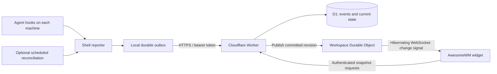

# Cloud collector design

This design moves collection to a TypeScript Cloudflare Worker with D1 storage. Each machine reports through a shell script; the existing AwesomeWM widget becomes an authenticated API consumer. The design was approved and implemented locally. Push and deployment are explicitly excluded from this work. See [collector/README.md](../collector/README.md) for runnable setup and current operational limits.

Implementation details: workspace revisions live on `workspaces`; v1 usage counters use explicit integer columns on `usage_records`, with schema migrations for future metrics. `usage_rollups` stores daily workspace/run/model/rate-set totals maintained during ingestion; snapshots never scan raw usage. Detailed evidence lasts seven days, daily totals and compact ended identities last 30 days, and one older cumulative baseline may survive within that window. The WebSocket protocol adds a client snapshot acknowledgement (`ack`) so each socket has at most one outstanding invalidation; later revisions coalesce until that acknowledgement. The widget's transport heartbeat runs every 20 seconds using the runtime auto-response. The operator CLI generates private provisioning SQL and can apply it only to local D1; revocation of existing sockets is bounded by their five-minute authorization lease. These choices keep the accepted architecture while making the first implementation concrete.

Repository boundaries: `collector/` owns the server and all authoritative state; `reporters/shell/` owns the Linux agent integration; `clients/awesomewm/` owns the first viewer and its legacy local backend. Desktop clients communicate through the [public protocol](client-protocol.md). Windows and macOS viewers are future consumers, not implemented platform support. The root Lua and hook files are compatibility forwarders. See the [migration guide](migration.md) for moved paths.

Assumptions: one owner initially, several machines or containers, multiple concurrent agents, Linux as the first fully supported reporting platform, and the existing widget as the first consumer. Agent names remain extensible. A web dashboard is a possible later consumer of the same API.

The recommendation is a shell client using `curl` and `jq`, scoped bearer tokens, an event journal plus current-session tables, and a hibernating WebSocket connection for the widget. WebSockets with hibernation are an accepted design decision. Preserving all existing behavior also needs local process and transcript observations; that work is explicitly included below.



The original local implementation established the following requirements (its Lua modules now live under `clients/awesomewm/`):

| Existing component | Current behavior | Consequence for this change |
| --- | --- | --- |
| `hook.sh` | Passes native JSON through local files; discovers the invoking PID through `/proc` | Replace transport and add stable installation/process identity |
| `install-hooks.sh` | Python installer, despite its filename; merges Claude and Codex configuration | Preserve merge/uninstall behavior; reporting does not require Python |
| `sessions.lua` | Reduces hooks into states, retires superseded sessions, checks processes, watches blocked-session transcripts | Move reduction to Worker; process/transcript observations must still originate on the machine |
| `cost.lua` | Incremental transcript parsing, Claude message deduplication, Codex cumulative usage | Hook forwarding alone cannot preserve remote costs |
| `init.lua` | Displays grouped state and costs | Replace local reads with API snapshots and add machine labels/freshness |

The implementation currently has no click-to-focus handler: `init.lua` binds hover and right-click refresh. The README mentions focus, but this proposal does not count it as existing implemented behavior. Any future focus action must verify the installation and process identity before using a local PID.

**Deployment and storage.** Use one Worker, one D1 database, and a SQLite-backed Durable Object class with one instance per workspace. D1 provides SQL indexes, constraints, and transactional batches, which fit event deduplication and current-state updates. Keep writes synchronous: success means the event, its projection, and a pending change notification committed. Use the D1 binding and primary reads initially. Cloudflare documents batch rollback and primary-read behavior in its [D1 database API](https://developers.cloudflare.com/d1/worker-api/d1-database/).

KV's eventual consistency is a poor fit for the authoritative state of rapidly changing sessions. This follows its documented [consistency model](https://developers.cloudflare.com/kv/concepts/how-kv-works/). The Durable Object manages authenticated subscriptions and notification delivery; D1 remains authoritative for agent state and usage. Queues and R2 are possible later additions if measured ingestion volume or archive size warrants them.

**Shell client.** Keep `hook.sh <agent> <event>` as the hook entry point. Use POSIX shell, `curl`, `jq`, and standard OS utilities. `jq` safely extracts allowed fields and constructs JSON; hand-built JSON and regex parsing would be fragile. Configuration lives under `${XDG_CONFIG_HOME:-$HOME/.config}/ai-agents`; a private state directory holds identity, counters, and the outbox. Tokens live in a separate mode-0600 file and are never embedded in registered hook commands or URLs.

Installation creates a random, stable `installation_id` and a human label such as `desktop`, `buildbox`, or `dev-container`. An installation identifies one user/configuration/PID namespace, not a hostname or physical computer. Separate containers and users get separate IDs. Cloned installations must regenerate IDs and credentials.

Each hook performs bounded local work: read and filter the payload, identify the process, assign an event ID and sequence, atomically spool the event, and attempt an immediate bounded flush. The lifecycle upload and a fresh observation of the identified agent ancestor each have a one-second network budget, within the installer's three-second Codex timeout. No long retries occur in the hook. It prints no stdout and exits successfully on reporting failure so it cannot alter an agent's permission or execution decision. Scheduled flushes allow ten seconds per request and stop starting requests after ninety seconds, retaining unacknowledged records for the next run.

Use a persistent outbox, not the runtime tmpfs directory: an outage or reboot should not silently lose pending events. One flusher sends bounded batches in sequence. Failed requests retain the original event IDs. Retry network errors, 429, and 5xx with capped backoff and jitter; honor `Retry-After`. Quarantine permanently rejected events and expose a diagnostic through a `status` command. Never let a malformed event block unrelated sessions indefinitely. Use recoverable locks and atomic file renames; do not depend on a background hook child surviving the agent's timeout cleanup.

A scheduled invocation of the same script retries the outbox even if no further hooks fire. Schedule: every five minutes on Linux via a user timer, with a cron option at lower resolution. This intentionally changes the README's no-polling promise. Hooks-only operation remains possible, with retries on the next hook or manual flush and weaker liveness guarantees.

Proposed outbox bounds are seven days and 32 MiB, configurable. Overflow or eviction increments a visible dropped-event counter; usage collection reports incomplete coverage. A successful response is required before deleting an acknowledged event. Network partitions remain observable gaps rather than a promise of lossless delivery under every local failure.

**Authentication.** Use `Authorization: Bearer <token-id>.<random-secret>`, with a cryptographically random 256-bit secret. Issue one write token per installation and a separate read token for the widget. The interface stays as simple as a shared token, but a lost machine can be revoked independently and a reporter cannot read all activity.

Store token IDs, SHA-256 secret digests, scopes, workspace/installation bindings, expiry, and revocation timestamps in D1. Compare fixed-length digests in constant time. Derive workspace and write-authorized installation from the token; never trust body fields to grant access. Every query includes that workspace scope. Token rotation allows overlap until the old token is revoked; token lookup is authoritative rather than served from an eventually consistent cache.

Provision tokens through an operator command with Cloudflare account access. Do not create a public registration or administration API initially. Store any deployment secrets using [Worker secrets](https://developers.cloudflare.com/workers/configuration/secrets/). Authenticate before parsing a bounded body; use prepared SQL, finite field lengths, per-token rate limits, and private non-shared-cache responses. Logs contain request IDs, rejection reasons, and durations, excluding tokens, native payloads, and conversation content.

**Wire contract.** `POST /v1/events` accepts a versioned batch, initially at most 16 events and 256 KiB total. Validate the complete batch before committing. One malformed batch is rejected with indexed error details so the flusher can quarantine or split it. Retrying a successful event is harmless. An example lifecycle event follows; IDs are illustrative.

```json
{
  "schema_version": 1,
  "events": [{
    "event_id": "event-uuid",
    "installation_id": "installation-uuid",
    "execution_id": "process-incarnation-uuid",
    "run_id": "run-uuid",
    "run_generation": 1,
    "sequence": 42,
    "observed_at": "2026-09-09T08:15:30.123Z",
    "agent": "claude",
    "agent_version": null,
    "native_session_id": "provider-session-id",
    "source_event": "PermissionRequest",
    "adapter_version": 1,
    "data": {
      "cwd": "/home/me/project",
      "model": "provider-model-id",
      "pid": 12345,
      "source": null,
      "notification_type": null
    }
  }]
}
```

The shell passes through only allowlisted metadata. It keeps transcript paths locally for observation and does not upload prompts, command arguments, tool inputs/results, transcript text, or arbitrary notification messages. A local adapter may emit a bounded notification category if a supported agent supplies no structured type. Unrecognized notifications are neutral. Working-directory reporting can be replaced by a configured project label.

The Worker converts source events into a small canonical vocabulary: `session.started`, `turn.started`, `attention.required`, `attention.cleared`, `turn.completed`, `session.ended`, and neutral metadata observations. Store both the original event name and normalization version. Validate the installed agents' hook contracts and fixtures before implementation; the event lists in this repository are evidence of current integration assumptions, not a guarantee for every CLI version.

API version, envelope version, and adapter version have separate meanings. Additive optional fields remain compatible; unknown envelope versions receive an explicit unsupported-version response. Unknown event names can be retained as neutral observations without changing state. Keep critical identity, authorization, ordering, and usage counters in validated columns rather than unrestricted JSON.

**Identity and schema.** Model a logical session separately from its executions. A native session can be resumed in a new process or on another machine; both executions may even coexist. PIDs, paths, and hostnames are attributes, never global keys.

All tables below carry `workspace_id`; foreign keys and unique constraints include it where needed to prohibit cross-workspace references. Use opaque text IDs, UTC integer milliseconds for database times, nonnegative integer counters, and versioned SQL migrations. JSON extension fields must be valid, bounded objects.

| Table | Main columns and constraints | Purpose |
| --- | --- | --- |
| `workspaces` | `id`, `name`, `reporting_timezone`, `created_at` | One seeded workspace; makes ownership and day boundaries explicit |
| `installations` | `id`, `label`, `platform`, `created_at`, `last_contact_at`, `capabilities_json`, `disabled_at` | Stable reporting origin and capability disclosure |
| `api_tokens` | `id`, `secret_hash`, `scope`, nullable `installation_id`, `expires_at`, `revoked_at` | Independent read/write credentials and rotation |
| `workspace_revisions` | `workspace_id` primary key, `revision` | Increasing revision for committed snapshot-visible changes |
| `notification_outbox` | `workspace_id` primary key, `pending_revision`, `delivered_revision`, `next_attempt_at`, `attempts` | Durable, coalesced publication work; pending means `pending_revision > delivered_revision` |
| `executions` | `id`, `installation_id`, `boot_id`, `pid`, `process_start_identity`, `agent`, `last_sequence`, `ended_at` | One process incarnation; Linux identity includes boot ID and process start ticks |
| `sessions` | `id`, `agent`, `identity_namespace`, `native_session_id`, nullable `parent_session_id`, `first_observed_at`; unique `(workspace_id, agent, identity_namespace, native_session_id)` | Logical conversation; namespace avoids assuming every provider's IDs are globally unique |
| `session_runs` | `id`, `installation_id`, `session_id`, `execution_id`, `generation`, `state`, `state_sequence`, `cwd`, `model`, `started_at`, `ended_at`, `end_reason`, `last_activity_at`, `last_alive_observed_at`, `presence_received_at`; unique `(workspace_id, execution_id, generation)` | A contiguous attachment of a conversation to a process; supports switching away and back within one process |
| `events` | `id`, `execution_id`, `sequence`, `run_id`, `source_event`, `canonical_type`, `schema_version`, `normalizer_version`, `observed_at`, `received_at`, `payload_hash`, `data_json`; unique `(workspace_id, execution_id, sequence)` | Immutable, sanitized observations with retry identity and ordering |
| `usage_records` | `id`, `provider`, `usage_namespace`, `native_record_id`, `session_id`, nullable `origin_run_id`, `model`, `occurred_at`, `measurement_kind`, `counter_epoch`, `counters_json`, `normalizer_version`; unique source identity within workspace/provider/namespace | Usage evidence separate from lifecycle; detailed metric rows below |
| `usage_metrics` | `usage_record_id`, `metric`, `quantity`, `unit`, `included_in`; unique `(usage_record_id, metric)` | Extensible counters, including cached/reasoning subsets without double counting |
| `price_rates` | `id`, `provider`, `model`, `metric`, `currency`, decimal rate text, unit quantity, `effective_from`, `effective_to`, `source` | Versioned estimates, with precise decimal arithmetic rather than floating-point money |

`usage_records`, `usage_metrics`, and `price_rates` are created when usage reporting is implemented. They are part of the target design, not a claim that bare hooks supply their data. Retain provider counters alongside derived billable quantities. Add a relation between usage records and observing runs when multiple transcripts contain the same record; aggregate the usage record once, rather than once per observation.

Useful initial indexes: live runs by `(workspace_id, installation_id, ended_at, last_activity_at)`; runs by logical session; events by execution/sequence and by run/received time; usage by workspace/time and workspace/model/time. A partial unique index permits only one current run per execution. Do not add project/account tables until those identities have a reliable source; nullable identifiers and explicit namespaces allow that later.

**Ordering and state correctness.** Generate one durable increasing sequence per execution under a short local lock, shared by hooks and reconciliation. A crash may leave a sequence gap; it must never reuse a value. If identity/counter state is lost, create a new execution identity. Map process fingerprints to execution UUIDs locally; when process identity is unavailable, report reduced capabilities and use an explicit weaker session-scoped stream instead of pretending PID 0 identifies a process.

Under the same lock, allocate a run UUID and increasing generation when the process changes native session or starts a new attachment after a closed run. Compaction retains the run. Include that identity on every event so the server need not reconstruct run boundaries from HTTP arrival order. The Worker verifies that a run's installation, execution, native session, and generation never change. The adapter uses an installation-scoped logical-session namespace by default; cross-machine linking requires a verified provider-wide identifier or explicit linking, rather than guessing from matching IDs or paths.

Order state by source sequence within an execution, never by server arrival or timestamps across machines. `observed_at` records client time; `received_at` records arrival and helps diagnose lag and skew. Source sequence orders reporting observations, not events that an agent failed to emit or delivered late to its own hooks.

In one D1 batch: validate identity relationships, insert the event idempotently, conditionally update the relevant projection, retire any superseded run, and, when snapshot-visible data changes, increment the workspace revision and upsert its notification outbox entry. Conditional updates must execute in SQL, not as an unguarded Worker read/modify/write. An identical duplicate returns success without changing totals, state, freshness, or revision. Reusing an event ID or sequence with different content returns 409. Keep separate state and metadata sequence guards: a neutral notification or heartbeat must not suppress an earlier state-bearing event arriving out of order. A run-switch sequence/tombstone prevents delayed old-session events from becoming current again. Late events remain useful history and usage evidence even when they cannot change current state. Presence, usage, settings, and retention changes that affect a snapshot follow the same revision/publication rule.

The state set is `idle`, `busy`, `asking`, `done`, `ended`, with `unknown` for a run first observed without a state-bearing event. Preserve current semantics: compaction does not reset a busy run; unknown notifications do not change state; completion marks a turn done, not the process dead. `SessionEnd` or confirmed local process disappearance closes a run. Switching native sessions in a process closes the previous run as `superseded`.

**Liveness and attention.** Track freshness separately from activity. A quiet session might be awaiting input for hours; lack of hooks cannot establish death. Never expire it into `ended` merely because a timer elapsed.

Scheduled reconciliation checks known process fingerprints and reports which tracked executions are alive or gone. It must report per-execution evidence: contact from one active session does not prove every process on that machine is alive. The presence interval is five minutes, with `stale` after ten minutes. Hooks-only installations expose freshness as `unverified`. Stale/unverified sessions remain visible separately from the confirmed-live count, with their last known state.

Presence is a current observation sent directly, not replayed from the durable historical outbox. Duplicate presence cannot renew a lease; delayed observations beyond the freshness window do not establish current liveness. Report both observation and receipt times, and flag unreasonable clock skew. After reconnecting, obtain new process observations; uploading old lifecycle events must not make dead processes look freshly alive.

Clearing `asking` also requires a signal. Prefer an explicit supported hook; otherwise reconciliation compares transcript activity against the checkpoint captured when attention was requested. Transcript growth can provide the same heuristic the current widget uses, but is not proof of user approval. Mark the observation's reason/confidence. A five-minute timer makes clearing slower than today's file watcher; faster observation would require a watcher or additional verified hook, with a corresponding increase in client work.

**Usage and costs.** The Worker cannot open a machine's transcript path. Preserving this feature therefore requires a local metadata extractor, invoked outside the hook's time budget, using shell plus maintained `jq` filters initially. Incremental offsets and parsing checkpoints remain local. Upload only usage IDs, timestamps, model IDs, and counters; keep prompts and generated text on the machine. Read complete JSONL records in bounded chunks, tolerate file rewrites/rotation, and advance durable parsing state only once the extracted records are durably spooled.

Claude-style per-message records deduplicate by provider message/request identity across copies and resumes, including across installations when identity is reliable. Repeated content blocks may differ in local timestamps; identical accounting retains the first accepted timestamp. Modern Codex response records provide exact per-request counters, including the first request, and supersede cumulative estimates on transcript replay. Older Codex cumulative records retain their counter stream, epoch, and timestamp; derive ordered deltas within that stream, and recompute adjacent deltas when earlier snapshots arrive. Do not sum cumulative snapshots. A reset starts a new epoch, and a missing baseline marks attribution incomplete rather than treating the full counter as new usage. Repeated/copied records must not gain fresh identities solely because they appear in another local path or outbox event.

Store original cumulative evidence so normalization can be corrected later. Cached input and reasoning output may be subsets of other counters; metric inclusion rules must prevent double billing. Associate deltas with a model only where the source supports it; a cumulative interval spanning a model switch can require unknown attribution. Missing usage means unavailable, not zero. Unknown pricing yields token counts plus a partial estimate, preserving the current user-facing distinction.

Use a configured workspace reporting timezone (initially `Asia/Singapore`, editable) for “today,” and UTC instants for storage. Totals include ended sessions. Rate-limit observations, if retained, need account/window/source identity and sampling time; percentages from different machines/accounts must not be summed or presented as one global plan limit. Detailed cross-machine costs and attention reconciliation are required before calling the migration feature-complete; a hooks-only preview must label both limitations.

**Read API and widget.** Provide `GET /v1/snapshot`, `GET /v1/sessions` with filters/cursors, `GET /v1/sessions/:id/events` for bounded diagnostics, and `GET /v1/usage?from=...&to=...`. Add `GET /v1/subscribe` for a WebSocket upgrade using the read token in the Authorization header. The Worker authenticates and routes to the workspace object using trusted token context; it must discard spoofed internal identity headers. Snapshot returns revision, server time, reporting interval/timezone, installation labels, current runs, state counts, freshness, usage coverage, and totals. Keep the existing Lua callback shape where practical and add explicit `stale`, `unverified`, and connection status fields. Bound responses and paginate full history; reject an oversized snapshot explicitly rather than silently returning an incomplete count.

**Hibernating subscriptions.** The workspace object accepts sockets with `ctx.acceptWebSocket()` and handles them through Durable Object WebSocket handlers. Store token ID, workspace, and authorization deadline in serialized socket attachments so they survive hibernation. Recover connections through the runtime API after waking; neither a module-global connection registry nor in-memory revision is authoritative. Keep the constructor small and avoid persistent JavaScript intervals or waiting loops. This follows Cloudflare's [WebSocket Hibernation guidance](https://developers.cloudflare.com/durable-objects/best-practices/websockets/).

After accepting a connection, send `{"type":"ready","protocol_version":1}`. Change signals are small invalidations such as `{"type":"state.changed","revision":42}`; they do not contain transcript text or session payloads. The widget subscribes first, then fetches a snapshot, recording the greatest notified revision while that fetch is in flight. If the snapshot revision is behind, fetch again. Coalesce bursts and permit one snapshot request in flight. Duplicate or older notifications need no additional fetch once their revision is covered. The same sequence runs on every reconnect, which closes the snapshot/subscribe race and recovers missed changes without requiring WebSocket event replay.

**Reliable publication.** After a D1 commit, attempt immediate publication through the Durable Object binding. The D1 outbox is committed with the state change, so a Worker crash between persistence and publication cannot permanently lose the signal. A scheduled Worker drains due outbox rows in bounded batches every minute as failure recovery. Immediate publication can run under `ctx.waitUntil()` to keep the hook fast; that mechanism alone is not the durability guarantee. The client may acknowledge ingestion before the widget has received the signal.

Before acknowledging publication, the object durably records the greatest pending revision and schedules an alarm for recovery, atomically in its own storage. It then broadcasts and clears only the revision it processed. A retry may broadcast twice; clients deduplicate by revision. Advance the D1 delivered revision only after the object has accepted durable responsibility, using a monotonic conditional update so concurrent newer work remains pending. Keep a durable published watermark inside the object to reject old RPC retries. With no subscribers, publication can complete without a broadcast because every new subscriber fetches current state. Object alarms retry pending broadcasts with bounded backoff; alarm handling must be idempotent because [Cloudflare alarms are delivered at least once](https://developers.cloudflare.com/durable-objects/api/alarms/). Delivery is eventual recovery while services are available, not an exactly-once or fixed-latency promise.

**Widget connection lifecycle.** Use an asynchronous GLib-integrated WebSocket transport, planned as libsoup 3 through the existing `lgi` bridge; validate that integration on the supported AwesomeWM runtime before implementing the UI adapter. This adds a widget-side dependency, while reporting machines still use only shell utilities. Libsoup provides an [asynchronous WebSocket connection API](https://libsoup.gnome.org/libsoup-3.0/method.Session.websocket_connect_async.html). Reconnect on disconnect with jitter and capped exponential backoff, resetting backoff after a stable connection. Failed snapshot requests also retain a pending refresh and retry independently, even when the socket stays open. Hover/right-click can request an immediate refresh. Keep the last good snapshot on failure and mark the collector connection stale; a failed request is not an empty list. There is no routine five-second snapshot polling.

Use a client-originated text `ping`/`pong` exchange with the object's `setWebSocketAutoResponse()` to detect silent broken connections without waking application code for each heartbeat. Proposed interval is 30 seconds with a bounded response timeout. This tests the transport, not reporter liveness or D1 health. Keep socket messages and connection counts bounded; close slow consumers rather than accumulating an unbounded send backlog. Configure the auto-response during initialization and use the [runtime's hibernation-compatible API](https://developers.cloudflare.com/durable-objects/api/state/).

Authorization is checked at upgrade and on every snapshot request. Give each socket a maximum five-minute authorization lease, limited further by token expiry; close and reconnect at the deadline to revalidate. Store the deadline in its attachment, filter expired sockets before broadcasts, and use a durable alarm to close them while idle. Token revocation also attempts immediate closure through the workspace object; the lease bounds continued subscription when that closure fails. One object has one alarm, so persist and schedule the earliest pending notification retry or authorization expiry and process due jobs together. These bounded wakeups allow hibernation between events; they do not promise zero activity or zero charges.

Without polling, time-dependent UI changes need explicit scheduling. Snapshots include each presence expiry and the next reporting-day boundary. The widget uses one-shot local timers, adjusted from server time, to mark sessions stale and to refresh totals at the next day boundary even if no event arrives. Refresh after desktop resume as well. Such refreshes may legitimately have the same data revision; server time and the reporting interval still change. WebSockets do not replace the reporting machines' process reconciliation, transcript observations, or delivery retries.

Use one consistent database read/batch for snapshot data and aggregates. Recompute freshness from server time on each response. Display `machine / project` labels and separate stale sessions from live badges. Future agents should display their own names even without a predefined label. Cloud mode gets all state and aggregate costs from the collector to avoid double counting local observations. Local mode can remain a selectable migration fallback, but a widget instance uses one authoritative backend at a time.

**Statistics and retention.** New usage contributes to indexed daily buckets in the same transaction as its deduplication record and run association. An out-of-order cumulative sample changes only its own contribution and its successor; exact response records replace superseded cumulative contributions. Snapshot reads use these compact buckets, with pricing resolved at materialization time. One revision and notification-outbox update is published per usage batch. See [statistics design](statistics.md) for the schema, migration, and measured read budget.

Keep detailed usage and lifecycle history for seven days and daily statistics for 30 days. Freeze aggregated contributions before removing their detailed evidence so pruning cannot subtract totals. Keep a recent cumulative baseline when needed, bounded by the 30-day statistics window. Acknowledge usage outside the seven-day acceptance window without recounting it; expired lifecycle replays are rejected. Strip old closed-run metadata after seven days and delete unreferenced ended identities after 30 days. Active runs remain tracked.

A five-minute scheduled invocation retries notification publication. Indexed retention work is gated to once per hour and bounded to 500 candidates per operation. Monitor D1 `rows_read` and `rows_written`, not just request count or duration. The Worker logs snapshot read cost and usage batch read/write cost. New cloud storage products are unnecessary for this workload; local transcripts retain longer-term history.

**Original implementation sequence.** First capture sanitized fixtures and contract tests from the currently supported agents and verify the widget's WebSocket transport dependency. Then implement the D1 migrations, authenticated ingestion, reducer, snapshot API, transactional notification outbox, and hibernating workspace Durable Object; add shell outbox delivery and the existing installer's cloud configuration; adapt the widget's subscription and reconnect behavior; and finish scheduled process/attention reconciliation plus usage extraction. Keep those as reviewable increments within the feature. Existing local cache files are not imported as cross-machine accounting truth; reconstruct supported history from deduplicated usage evidence or clearly start coverage at installation.

Acceptance cases include duplicate HTTP retries after commit, reversed arrivals, concurrent hooks, two machines with the same PID/native session ID, compaction, session switching and switching back, process death/PID reuse/reboot, offline replay, stale presence, clock skew, token revocation and cross-installation writes, forked/copied usage, cumulative resets and missing baselines, midnight/timezone boundaries, and widget reconnect without double counting. Subscription tests cover a commit during initial snapshot fetch, failed publication after commit, duplicate/out-of-order publications, a crash after object acceptance but before broadcast, hibernation and attachment restoration, alarm retries, expired/revoked subscriptions, silent connection loss, snapshot failure on an otherwise healthy socket, slow consumers, and stale/day-boundary UI changes without incoming messages. Verify shell timeout behavior, deployment-backed D1 transaction semantics, and actual Cloudflare hibernation/auto-response behavior, not only a pure reducer or local emulator test.

Accepted decisions: viewer clients use WebSockets with Durable Object hibernation; the Linux reporter uses `jq` and scheduled reconciliation/flush; the AwesomeWM client uses GLib/libsoup; attention clearing may take a reconciliation interval. These are implemented, with hooks-only operation available as a limited reporter configuration.
