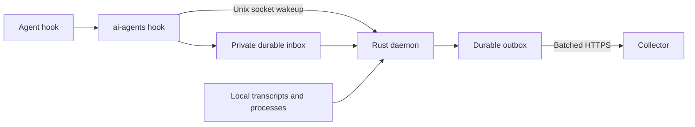

# Rust reporting daemon

One Linux process handles Claude Code and Codex activity, uploads, usage extraction,
and reconciliation. Hooks run `ai-agents hook <agent> <event>` and return after a
small local write. The daemon uses a Unix socket wakeup to process it immediately.
It needs no shell utilities, Python, cron, or systemd at runtime. Python is used
only by the installer; systemd is an optional supervisor.

## Install or migrate

For the complete Linux setup, see the [systemd installation guide](../../docs/linux-systemd.md),
including headless-server boot, proxy settings, custom paths, and manual unit installation.

Build with Rust 1.89 or newer:

```sh
cargo build --release --locked --manifest-path reporters/rust/Cargo.toml
python3 reporters/rust/install.py --service
```

Existing installations reuse their collector configuration and credentials. For a
new machine, [provision a write credential](../../collector/README.md), then run:

```sh
python3 reporters/rust/install.py --service \
  --cloud-url https://your-collector.example \
  --installation-id your-machine --token-file /path/to/credential.token
```

The installer copies the binary to `~/.local/bin/ai-agents`, merges both agents'
hooks, and backs up their configuration. `--agent codex` or `--agent claude` selects
one agent. `--dry-run` previews changes. `--binary /path/to/ai-agents` installs a
prebuilt binary; `--bin-dir` changes its destination. Build for the destination
machine's architecture and libc. A collector configuration or all three cloud
options are required. Use loopback HTTP only for local development.

`--service` installs **one** `ai-agents.service` and disables the old reconciliation
timer, upload path watcher, and their services. The installer copies the shared
[service unit](systemd/ai-agents.service) from this repository. Its `%h` paths work
for any reporting user; custom paths go in the managed
`ai-agents.service.d/00-installer-paths.conf` override. Existing service drop-ins are
carried forward, including proxy environment files. Legacy unit files, credentials,
and state remain available for rollback. Do not run both reporters against the
same state directory; the daemon holds their existing locks.

When copying the installer to another machine, include `systemd/ai-agents.service`
beside it in the same relative directory. The optional
[network override example](systemd/10-network.conf.example) can be copied too.
See the [prebuilt installation steps](../../docs/linux-systemd.md#install-a-prebuilt-binary-on-another-machine).

Without `--service`, stop your previous reporter/scheduler and launch
`ai-agents daemon` under your own supervisor. The daemon runs in the foreground,
handles SIGTERM/SIGINT, and owns all deadlines internally. No timer is required.

Codex may ask you to trust the changed hook configuration. Updating the legacy
`reporters/shell/hook.sh` alongside the binary lets already-running agents with a
cached old hook command forward to Rust through the `daemon-binary` configuration
marker. On machines with separately copied shell scripts, update that shim too,
or restart the agent after trusting the new hooks.

## Flow and resource use



- Hooks allowlist metadata before writing it, notify the daemon without waiting for
  a network request, and always exit successfully. If the daemon is stopped, its
  next startup consumes the inbox. Prompts, tool arguments, generated content, and
  notification text are never persisted in the inbox or uploaded.
- The daemon uses [Tokio's current-thread runtime](https://docs.rs/tokio/latest/tokio/runtime/), one reusable HTTP client, and one
  request in flight. Slow network requests do not block hook intake. It sleeps
  between local wakeups and deadlines rather than polling a work queue continuously.
- Hooks trigger immediate collection. Every 30 seconds it checks known local
  processes and transcript sizes, including late Codex transcript discovery.
  Only appended complete JSONL records are parsed. Backlogs are processed in
  1 MiB chunks with yields between runs; unusually long lines are bounded at
  16 MiB and diagnosed. Closed runs stop reading after their final complete scan.
- Presence is sent when live-run membership or coverage changes, and at most
  once every five minutes for unchanged live processes. With no live processes,
  the last acknowledged observation is persisted and unchanged scans/heartbeats
  send nothing, including after a daemon restart. Failed requests still retry.
  Presence always checks
  the process's current boot ID, PID, and start time; offline event replay cannot
  renew a dead process's lease.
- Lifecycle batches contain at most 16 events; usage batches at most 64 records,
  also bounded by request bytes. Failed requests use persisted exponential backoff
  and jitter, honoring numeric `Retry-After` up to one day. Quota outages therefore
  do not cause frequent cloud requests. Rejected batches are split to isolate bad
  records, which move to quarantine; missing acknowledgements retain their IDs.

Configuration defaults to `${XDG_CONFIG_HOME:-$HOME/.config}/ai-agents`, state to
`${XDG_STATE_HOME:-$HOME/.local/state}/ai-agents`. `AI_AGENTS_CONFIG_DIR` and
`AI_AGENTS_STATE_DIR` override them, including in installed hook commands. State
is private (directories 0700, files/socket 0600). Use a reasonably short state path:
Linux Unix socket paths are limited to approximately 107 bytes.

The daemon retains the shell reporter's run IDs, sequence counters, outbox format,
usage IDs, and cursor keys. A small write-ahead transaction protects run/sequence
updates and inbox consumption across crashes. Usage reaches the durable outbox
before cursor advancement; any crash replay retains provider IDs for deduplication.
Queues have a seven-day retry horizon and a 32 MiB capacity target each, pruned at
startup and every five minutes. Dropped/quarantined records and missing observed
transcripts keep coverage incomplete. Closed probes without transcripts do not.
Cloud retention and accounting are unchanged.

## Measured baseline

On ArchDell, the optimized x86-64 release binary was 2.9 MB. An isolated local
collector test measured hook command latency at 1.6 ms median and 2.7 ms p95 over
30 calls. With a caught-up transcript, the daemon used 4,680 KiB RSS and one thread;
a 35-second idle sample consumed 0.00 CPU seconds at the kernel clock-tick
resolution and made zero HTTP requests. These are local measurements, not latency
or memory guarantees for large transcripts, proxy connections, or remote servers.

## Operate and validate

```sh
~/.local/bin/ai-agents status
~/.local/bin/ai-agents status --json
~/.local/bin/ai-agents web --expires 10m
~/.local/bin/ai-agents reconcile  # wake a local scan now
systemctl --user status ai-agents.service
journalctl --user -u ai-agents.service
```

`status` prints a readable summary of process identity, pending hooks, uploads,
quarantine, and last scan health. Use `--json` for scripts. Color is enabled only
in a terminal and respects `NO_COLOR`. `web` creates a single-use login URL for
the [web panel](../../clients/web/README.md); `--expires` accepts 60s–1h (default
10m), and `--json` returns the URL and expiry timestamps. Browser access lasts up
to 30 days and is tied to the originating write credential. Both the daemon and CLI support an optional `proxy_url` in the private
`config.json`, for example `"proxy_url": "http://127.0.0.1:7890"`. It overrides
automatic proxy discovery while retaining `NO_PROXY` exclusions. Without it,
each process uses its own network/proxy environment. Restart the daemon after
changing its configuration. `flush` also wakes reconciliation; neither command bypasses
server backoff. Credentials are loaded on daemon startup; restart after rotation.

Missing transcripts are identified in the daemon journal with
`usage coverage incomplete:` followed by structured fields for the reason, agent,
run ID, native session ID, closed/open state, and expected local transcript path.
The daemon logs each missing-transcript issue once when it appears or changes,
and logs when the transcript is found or the run leaves the retention window.
Unchanged issues are not repeated every 30 seconds; restarting the daemon reports
currently missing transcripts again. These diagnostics stay in the local journal.

```sh
journalctl --user -u ai-agents.service --grep='usage coverage'
```

```sh
cargo fmt --manifest-path reporters/rust/Cargo.toml --check
cargo clippy --locked --manifest-path reporters/rust/Cargo.toml --all-targets -- -D warnings
cargo test --locked --manifest-path reporters/rust/Cargo.toml
cargo build --locked --manifest-path reporters/rust/Cargo.toml
python3 -m unittest discover -s reporters/rust/tests -v
```

Tests use isolated state and a local HTTP server. They cover slow/offline transport,
restart/backoff, crash recovery, privacy, batching, acknowledgements, rejected
records, process reuse, transcript rotation/partial records, resumed sessions,
legacy cursor compatibility, and installer migration. They do not contact production.

Uninstall with `python3 reporters/rust/install.py --uninstall --service` (use the
same `--agent` selection if applicable). Credentials, binary, and pending data are
preserved. To roll back, stop the daemon, restore legacy hook settings or run the
shell installer, remove `config/daemon-binary`, and re-enable the legacy units.
Drain pending Rust inbox entries before rollback; the old shell reporter does not
consume that inbox, while existing outbox items and cursors are shared.
